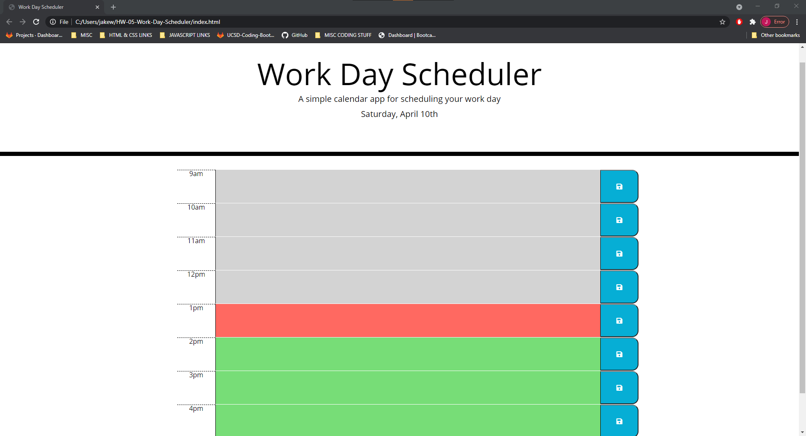
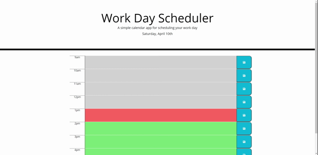

# HW-05-Work-Day-Scheduler 
## Table of Contents
* [Description](#Description)
* [Technologies](#technologies)
* [Demonstration](#demonstration)
* [Instructions](#instructions)
* [Acknowledgements](#acknowledgements)
* [Questions](#questions)
## Description 
This is a daily scheduler application built using html, css, javascript and 3rd Party Web APIs: Jquery, Moment.js and Bootstrap. 

## Technologies
* HTML
* CSS
* Javascript
* Bootstrap
* Jquery
* Moment.js
## Demonstration

## Instructions
The user clicks on an hour time slot and inputs their scheduled activity for that hour.  Hour time blocks are highlighted in grey(past), red(current), and green(future).  The user can click the save button and the scheduled activity will remain in the planner. 
### About Us
N.A.
## Installation
N.A.
## Team Members
* Jake Williams
## Acknowledgements
* UCSD Coding Bootcamp instructional team and classmates
    * BCS Tutor "Arm" 
## Questions 
If you have any questions, please contact me on:
GitHub at [Jake](https://github.com/jakewill1107)
Email at [Jake](mailto:jbwilliams84@mail.com)

## Link to Deployed Website
https://jakewill1107.github.io/HW-05-Work-Day-Scheduler/